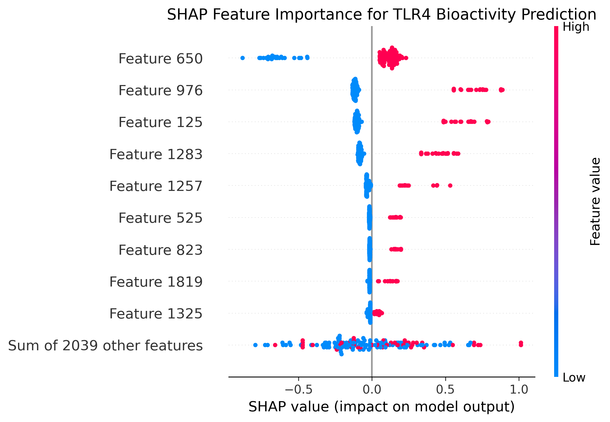
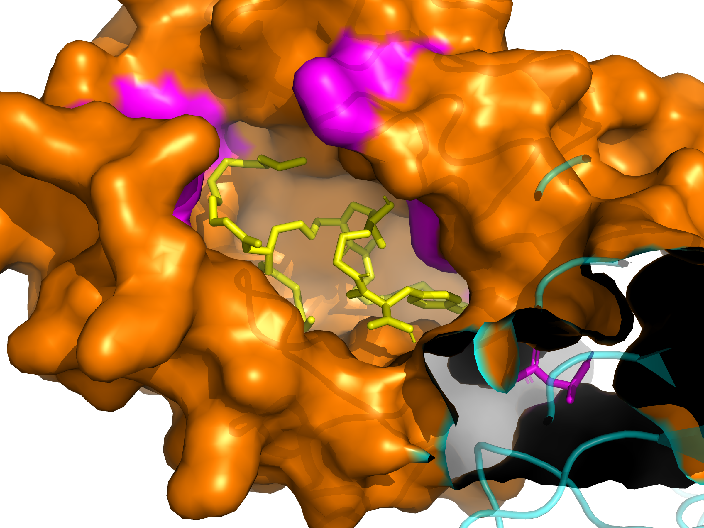

# TLR4-MD2 Computational Drug Discovery

### Interpretable Machine Learning and Structure-Based Virtual Screening for TLR4 Ligand Identification

[](https://www.python.org/)
[](LICENSE)
[](https://colab.research.google.com/)
[](https://github.com/hafizimmuno/TLR4-Computational-Drug-Discovery)
[](https://www.rcsb.org/structure/3FXI)

---

## Research Question

> **Can interpretable machine learning combined with structure-based molecular docking reliably identify biologically relevant small-molecule modulators of the TLR4-MD2 complex, and what molecular features drive activity?**

This project addresses a core challenge in computational immunopharmacology: bridging statistical bioactivity patterns from large databases with structural binding evidence at the atomic level, while maintaining full model interpretability for hypothesis generation.

---

## Biological Background

**Toll-Like Receptor 4 (TLR4)** is a pattern recognition receptor on innate immune cells that detects bacterial lipopolysaccharide (LPS) and initiates the inflammatory cascade. TLR4 signals through its co-receptor **MD-2**, which contains a deep hydrophobic pocket where LPS binds. This pocket is the primary druggable site on the complex.

Dysregulation of TLR4 signaling underlies two major therapeutic areas:

- **Vaccine adjuvants** — TLR4 agonists amplify adaptive immune responses, directly relevant to vaccine design
- **Sepsis and chronic inflammation** — TLR4 antagonists can suppress dangerous cytokine storms in infection and autoimmunity

Understanding the molecular determinants of TLR4-MD2 ligand binding is directly relevant to both immunotherapy and anti-inflammatory drug design. Interpretable computational models can guide experimental collaborators toward the most promising candidates.

---

## Hypothesis

Compounds that are statistically similar to known TLR4 actives in chemical space (ML prediction) should also demonstrate favorable geometric and energetic complementarity within the MD-2 binding pocket (docking). A significant correlation between these two independent metrics would validate that the ML model captures real structure-activity relationships, not statistical noise, and that the docking pipeline correctly identifies the biologically relevant binding mode.

---

## Project Pipeline

```
ChEMBL Database (TLR4 bioactivity data, CHEMBL5255)
              │
              ▼
    Data Curation & Aggregation
    (IC50, EC50, Ki → pChEMBL, nM units)
              │
              ▼
    ECFP4 Molecular Fingerprints
    (Morgan radius=2, 2048 bits, RDKit)
              │
        ┌─────┴──────┐
        ▼            ▼
  Random Forest   Decision Tree
  Regressor       Classifier
  (pChEMBL        (IF-THEN rules,
  prediction)      max_depth=4)
        │            │
        ▼            ▼
     SHAP         Rule
  Explainability  Extraction
        │
        ▼
  Top 15 Drug-Like Candidates
  (MW < 600 Da, RotBonds ≤ 10)
        │
        ▼
  AutoDock Vina — MD-2 Pocket
  (PDB: 3FXI, Chain C center, exhaustiveness=8)
        │
        ▼
  Consensus Ranking
  (ML rank + Docking rank)
        │
        ▼
  Hit Optimization
  (R-group enumeration, Lipinski filter, docking validation)
```

---

## Key Results

| Metric | Value | Biological Significance |
| --- | --- | --- |
| ML–Docking Correlation | **r = 0.63, p = 0.012** | Two independent methods significantly agree: validates ML captures structural information |
| Random Forest ROC-AUC | **0.840** (5-fold CV) | Strong discrimination of active vs inactive TLR4 ligands |
| Decision Tree ROC-AUC | **0.805** (5-fold CV) | Interpretable rules with only 3.5% accuracy trade-off |
| Best Docking Score | **−9.29 kcal/mol** | Strong predicted binding affinity in MD-2 pocket |
| Consensus Hits | **3 compounds** | Ranked highly by both independent methods |
| Best Analogue | **CN substitution, −9.16 kcal/mol** | Closest analogue to parent docking score among 21 generated variants |

---

## Key Figures

### SHAP Feature Importance — What Drives TLR4 Activity?



**Interpretation:** SHAP analysis reveals that the most influential ECFP4 fingerprint bits correspond to hydrophobic and aromatic structural environments. When these features are **present** (red, high feature value), they push predictions toward higher pChEMBL — consistent with TLR4's known biology: the MD-2 pocket is predominantly hydrophobic, and recognition is driven by lipid chain burial. The model has learned chemically meaningful patterns, not statistical artifacts.

---

### Structure-Based Docking — Ligand in the MD-2 Pocket



**Interpretation:** A reference LPS-mimetic ligand docked into the hydrophobic MD-2 pocket (orange surface, Chain C) of the TLR4-MD2 complex (PDB: 3FXI, exhaustiveness=8). The yellow ligand is buried within the pocket, making contacts with key residues shown in magenta (PHE76, ARG90, PHE104, PHE126). PHE76, PHE126, and ARG90 are established critical residues for MD-2 ligand binding in the literature — their involvement validates that the docking pipeline correctly identifies the biologically relevant binding mode.

---

## Biological Interpretation of Results

**The r = 0.63 correlation (p = 0.012) means more than a statistical result.**

It demonstrates that compounds the ML model identifies as structurally similar to known TLR4 actives in ChEMBL also tend to fit geometrically and energetically into the MD-2 pocket. This cross-validation between a data-driven approach and a physics-based approach provides higher confidence than either method alone — directly reflecting how computational predictions are used to prioritize compounds for experimental testing.

**SHAP analysis reveals that hydrophobic and aromatic features dominate TLR4 activity prediction** — consistent with the biology of the MD-2 hydrophobic pocket, which evolved to recognize the lipid A portion of LPS. Small molecules that mimic this hydrophobic burial while adding polar anchoring (ARG90, TYR65) represent the most promising design hypothesis.

**The Decision Tree (ROC-AUC 0.805) provides directly actionable rules** — a synthetic chemist can assess whether a proposed compound satisfies an activity rule without running any software, enabling rapid hypothesis testing in the design-make-test cycle.

---

## Notebooks

### Notebook 01 — ML Bioactivity Modeling

`01_TLR4_ML_Bioactivity_Modeling.ipynb`

Retrieves human TLR4 bioactivity data from ChEMBL (CHEMBL5255), curates to quality-controlled IC50/EC50/Ki measurements in nM units, and aggregates per molecule using median pChEMBL. Converts molecules to ECFP4 Morgan fingerprints and trains a Random Forest Regressor to predict continuous pChEMBL values. Applies SHAP to identify which structural features drive TLR4 activity.

| Parameter | Value |
| --- | --- |
| Data source | ChEMBL CHEMBL5255 — human TLR4, functional assays, nM |
| Features | ECFP4 fingerprints (2048-bit, radius=2) |
| Model | Random Forest Regressor (n=300 trees) |
| Validation | 5-fold cross-validation |
| Explainability | SHAP beeswarm + substructure mapping |

---

### Notebook 02 — Molecular Docking Pipeline

`02_TLR4_Molecular_Docking.ipynb`

Downloads the TLR4-MD2 crystal structure (PDB: 3FXI) in mmCIF format, parses with BioPython MMCIFParser, and cleans by retaining Chain A (TLR4) and Chain C (MD-2) while removing heteroatoms and non-standard residues. Calculates the geometric center of MD-2 as the docking grid center and runs AutoDock Vina on a reference LPS-mimetic compound to validate the pipeline.

| Parameter | Value |
| --- | --- |
| Structure | PDB 3FXI (human TLR4-MD2 complex) |
| Binding site center | x=29.39, y=1.30, z=20.49 |
| Search box | 24 × 24 × 24 Å |
| Exhaustiveness | 8 |
| Poses reported | 3 |
| Best pose affinity | −7.351 kcal/mol |

---

### Notebook 03 — Integrated ML–Docking Pipeline

`03_TLR4_Integrated_ML_Docking_Pipeline.ipynb`

The core pipeline notebook connecting Notebooks 01 and 02. The trained RF model predicts pChEMBL for all compounds filtered to drug-like chemical space. The top 15 candidates are docked into the MD-2 pocket. Consensus ranking averages ML rank and docking rank to identify compounds validated by both independent approaches.

| Parameter | Value |
| --- | --- |
| Candidates screened | 15 drug-like compounds |
| Drug-like filter | MW < 600 Da, RotBonds ≤ 10 |
| Consensus method | Average of ML rank + docking rank |
| ML–Docking correlation | Pearson r = 0.63, p = 0.012 |
| Exhaustiveness | 8 |

---

### Notebook 04 — Decision Tree and Rule Extraction

`04_TLR4_Decision_Tree_Rule_Extraction.ipynb`

Trains a shallow Decision Tree classifier (max_depth=4, balanced class weights) on binary TLR4 activity labels (pChEMBL ≥ 6 = active). Extracts explicit IF-THEN rules from all root-to-leaf paths and maps rule-critical fingerprint bits back to chemical substructures. Compares Decision Tree vs Random Forest on the interpretability-accuracy trade-off.

| Parameter | Value |
| --- | --- |
| Model | Decision Tree (max_depth=4, balanced) |
| Activity threshold | pChEMBL ≥ 6 (≤ 1 µM potency) |
| Decision Tree ROC-AUC | 0.805 (5-fold CV) |
| Random Forest ROC-AUC | 0.840 (5-fold CV) |
| Accuracy trade-off | 3.5% for full interpretability |

---

### Notebook 05 — Hit Optimization: Analogue Design and Screening

`05_TLR4_Analogue_Design_and_Screening.ipynb`

Starting from the best consensus hit (CHEMBL3261034, docking score −9.29 kcal/mol), a focused analogue library of 21 drug-like variants is generated through systematic R-group substitution using RDKit. Each analogue is filtered for drug-likeness (Lipinski criteria) and scored using the retrained Random Forest model. The top 5 ML-predicted analogues are docked into the TLR4-MD2 binding site and compared against the parent compound. This notebook implements the design-make-test cycle and identifies the limit of simple scaffold decoration, motivating future generative modeling approaches.

| Parameter | Value |
| --- | --- |
| Parent compound | CHEMBL3261034 (best consensus hit from Notebook 03) |
| Parent docking score | −9.29 kcal/mol (exhaustiveness=8) |
| Substituents tested | 20 R-groups (halogens, polar, bioisosteres, alkyl) |
| Analogues generated | 21 drug-like variants |
| Analogues docked | Top 5 by ML prediction |
| Best analogue docking | −9.16 kcal/mol (+CN substitution) |
| Drug-like filter | MW < 600 Da, LogP < 6, RotBonds ≤ 10 |

---

## Top Consensus Hits

| Compound | ML Predicted pChEMBL | Docking Score | Observed pChEMBL |
| --- | --- | --- | --- |
| CHEMBL3261034 | 6.28 | −9.29 kcal/mol | 6.41 |
| CHEMBL4643502 | 6.28 | −9.19 kcal/mol | 6.60 |
| CHEMBL224563 | 6.46 | −7.35 kcal/mol | 6.80 |

ML predictions closely match experimentally observed pChEMBL values on all three top hits, confirming the model captures real structure-activity relationships rather than overfitting.

---

## MD-2 Binding Pocket Analysis

PyMOL analysis of the best consensus hit docked into the MD-2 pocket (PDB: 3FXI) identified **34 contact residues within 4 Å**:

**Critical hydrophobic contacts:** PHE76, PHE104, PHE119, PHE121, PHE126, PHE147, PHE151, ILE32, ILE44, ILE46, LEU54, VAL24

**Polar and H-bond interactions:** TYR65, TYR131, THR115, SER120, CYS133

**Electrostatic anchoring:** ARG90 (key positive charge), GLU92

PHE76, PHE126, and ARG90 are established critical residues for MD-2 ligand binding in published crystal structures and validate the biological relevance of the predicted binding mode.

---

## Limitations and Future Directions

### Current Limitations

**Dataset:** ChEMBL TLR4 data integrates measurements from multiple assay formats. Despite pChEMBL standardization, experimental heterogeneity introduces variability. The dataset is dominated by lipid-like LPS analogs — drug-like small molecule coverage is limited.

**Docking:** AutoDock Vina uses a rigid receptor model. Induced-fit effects and protein flexibility are not captured. Docking scores are estimates and do not account for solvation entropy or protein dynamics.

**ML model:** ECFP4 fingerprints use hashed bit representations — hash collisions can occur and 3D conformational effects are not captured. Internal cross-validation was used throughout; true external validation on an independent compound set would provide stronger generalizability evidence.

**Analogue generation:** Notebook 05 uses rule-based R-group substitution on a single scaffold. Simple decoration does not improve on the parent docking score (best analogue: −9.16 vs parent −9.29 kcal/mol), demonstrating the limit of this approach and motivating learned generative models for broader chemical space exploration.

### Future Directions

- **Molecular dynamics** — simulate stability of docked complexes over time
- **Deep generative modeling** — SMILES-based VAE or RNN to propose novel TLR4 modulators beyond ChEMBL chemical space
- **Expand dataset** — integrate PubChem BioAssay TLR4 data and pathway-specific endpoints
- **Multi-task modeling** — model agonist vs antagonist activity separately, connecting to downstream cytokine outcomes
- **Experimental validation** — pass consensus hits to in vitro TLR4 stimulation assays (NF-κB reporter, cytokine ELISA)

---

## Installation

All notebooks run on **Google Colab**. Clone and open directly:

```
git clone https://github.com/hafizimmuno/TLR4-Computational-Drug-Discovery.git
```

Install Python dependencies:

```
pip install -r requirements.txt
```

Additional Colab system installations (included at top of each notebook):

```
apt-get install -y openbabel autodock-vina
pip install vina
```

---

## Methods Summary

| Step | Method | Tool |
| --- | --- | --- |
| Data retrieval | ChEMBL API query (CHEMBL5255) | chembl-webresource-client |
| Molecular representation | ECFP4 Morgan fingerprints (r=2, 2048-bit) | RDKit |
| Activity prediction | Random Forest Regressor (n=300) | scikit-learn |
| Model explainability | SHAP beeswarm + bar plots | shap |
| Classification + rules | Decision Tree (max_depth=4) | scikit-learn |
| Analogue generation | R-group substitution + Lipinski filter | RDKit |
| Protein preparation | Chain selection, heteroatom removal | BioPython |
| Format conversion | mmCIF/PDB → PDBQT | Open Babel |
| Molecular docking | AutoDock Vina (exhaustiveness=8) | vina |
| 3D visualization | Protein-ligand complex figures | PyMOL |
| Statistical validation | Pearson correlation, 5-fold CV | scipy, scikit-learn |

---

## Repository Structure

```
TLR4-Computational-Drug-Discovery/
│
├── 01_TLR4_ML_Bioactivity_Modeling.ipynb
├── 02_TLR4_Molecular_Docking.ipynb
├── 03_TLR4_Integrated_ML_Docking_Pipeline.ipynb
├── 04_TLR4_Decision_Tree_Rule_Extraction.ipynb
├── 05_TLR4_Analogue_Design_and_Screening.ipynb
├── requirements.txt
├── figures/
│   ├── shap_beeswarm.png
│   └── TLR4_docking_figure.png
├── LICENSE
└── README.md
```

---

## Contact

**Hafiz Hassan Ahmad**
Veterinarian | Computational Immunology Researcher
hafiz.hassan.ahmad88@gmail.com
GitHub: [@hafizimmuno](https://github.com/hafizimmuno)

---

## License

This project is licensed under the MIT License — see the [LICENSE](LICENSE) file for details.

---

*Built with Google Colab | RDKit | AutoDock Vina | scikit-learn | SHAP | PyMOL*
